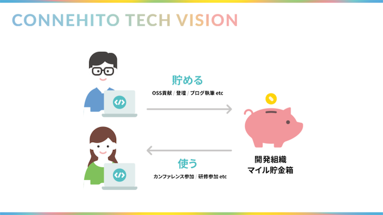

# スマイル制度

スマイル制度は「技術コミュニティになくてはならない開発組織をつくる」をコンセプトにしたアウトプット支援制度です。

## 制度概要

エンジニアやデザイナーは、カンファレンスや勉強会での登壇やブログの執筆、OSSへのコントリビュートなどのアウトプットを行うとマイル（1マイル=1円）という報酬を受け取ることが出来ます。ポイントとしては、このマイルは個人ではなく、チームに還元される点にあります。ですので、貯めたマイルはチームの共有資産として、誰でも自由に（1人あたり最大8万円/年）使うことが出来ます。これにより、個人ではなくチームでのインプットとアウトプットの活性化を促進しています。

## 大切にしていること

スマイル制度で大切にしていることは二つあります。

一つは技術コミュニティへの「恩返し」です。コネヒトはこれまで（そして、きっとこれからも）多くのOSSの活用したり、他社の事例を参考にしたりすることで成長してきました。ですので、コネヒトとして積極的にOSSの世界に貢献したり、事例を発信したりすることで技術コミュニティの発展に貢献していきたいと考えています。そして、そんなGive&Takeのループで、コネヒトも技術コミュニティもWin-Winな関係を築いていくためにスマイル制度は生まれました :recycle:

もう一つは「お金だけをモチベーションの源泉にしない」ことです。もちろん、お金は重要です。当初、この制度を立ち上げる際にアウトプットに対して対価を払うことも検討しましたが、それでは順番が逆だと考えました。本来、アウトプットの前に何らかのインプットがあり、お金はそのインプットのために必要なものだと思います。また、お金のモチベーションは長続きしません。ですので、スマイル制度では、マイルを個人ではなくチームの報酬とすることで、必要な時に必要な支援が受けられることや仲間の背中を押せること、何に投資するかをみんなで議論が出来るような設計にしています。

## 事例

過去の事例を一部抜粋して紹介します。

### アウトプット

* AWS DevDay Tokyoへの登壇
* 技術書の執筆
* CakePHPへのコントリビュート

### インプット

* スクラムマスター研修の参加費用
* 海外カンファレンスへ参加するための旅費
* 大学が主催している公開講座への参加費用

## Appendix

* [コネヒトは技術コミュニティになくてはならない開発組織を目指すために「スマイル制度」をはじめました！](https://tech.connehito.com/entry/2019/08/22/111953)
* [技術コミュニティになくてはならない組織を目指すための旅路](https://speakerdeck.com/itosho/aim-for-the-indispensable-company-for-our-engineer-community)
