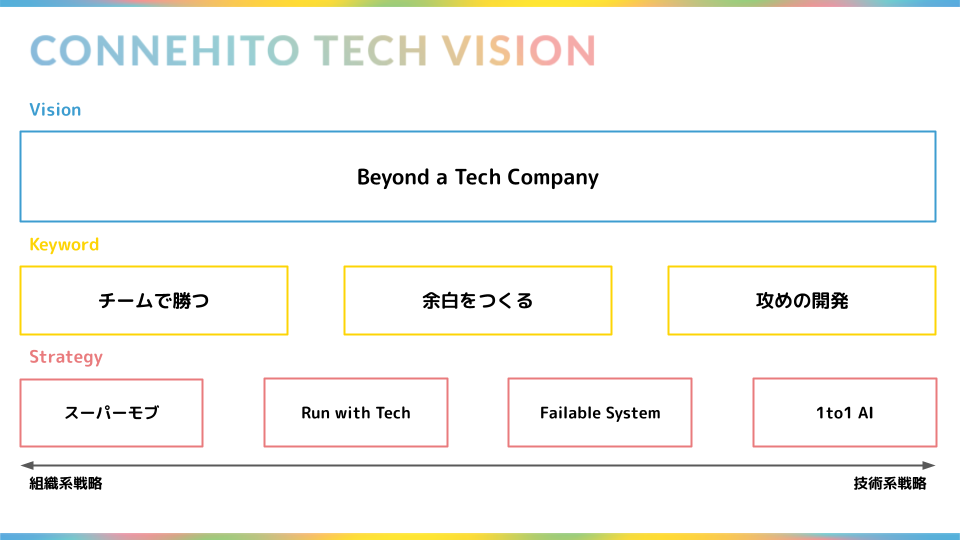

# Strategy

ストラテジーは「Beyond a Tech Company」という山の「登り方」をまとめたものになります :mount_fuji:

ストラテジーは外部環境や内部環境を鑑みた上で策定しています。しかし、変化が当たり前の今の時代において、ストラテジーはイミュータブルではなく、ミュータブルであるべきだと考え、継続的な見直しと必要に応じてアップデートを積極的に行います。

## 3つのキーワードと5つの戦略

現在、ストラテジーは3つのキーワードと4つの戦略から構成されています。3つのキーワードは戦略の方針となるもので、キーワードをベースに4つの具体となる戦略を掲げています。

### 3つのキーワード

* 攻めの開発
  * 変化に適応するために新しいチャレンジを積極的に行う
* チームで勝つ
  * 個人ではなくチームの成果を最大化させることで事業価値を最大化させる
* 余白をつくる
  * 余白（言い換えると、可能性）を増やすためにプロダクト開発以外の時間を意図的に増やす

### 4つの戦略

* スーパーモブ
* Run with Tech
* Failable System
* 1to1 AI

