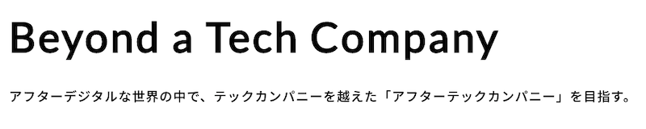
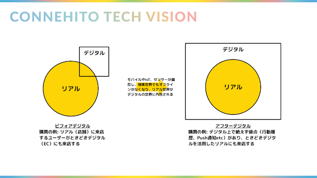
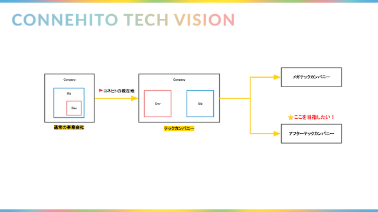
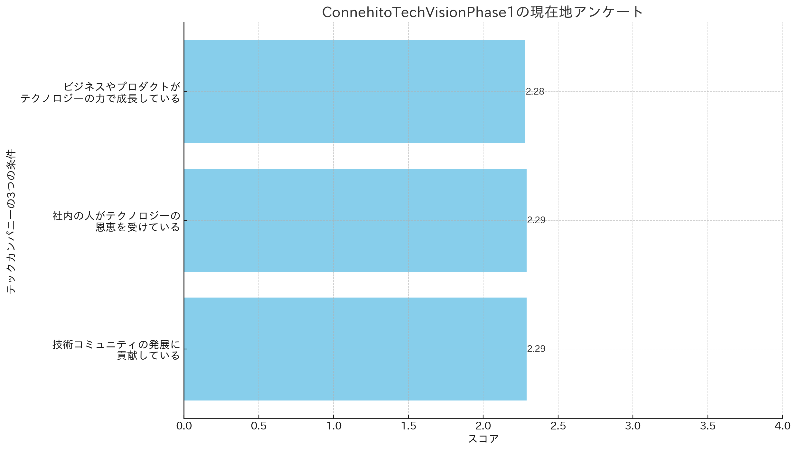

# Vision

Connehito Tech Visionでは**「Beyond a Tech Company」**というビジョンを掲げています。また、副題として**"アフターデジタルな世界の中で、テックカンパニーを越えた「アフターテックカンパニー」を目指す。"**というタグラインを設定しています。

## 「Beyond a Tech Company」に込めた想い

ここでは「Beyond a Tech Company」というビジョンに込めた想いやその背景を紹介します。

### そもそも、テックカンパニーとは？

このビジョンは、文字通りテックカンパニーを越えていくという意味です。しかし、このビジョンはテックカンパニーそのものを否定するものではなく、もちろん、コネヒトもテックカンパニーであるべきだと考えています。しかし、そもそもテックカンパニーとは何でしょうか？その定義は曖昧で、会社によって解釈は様々だと思いますが、コネヒトではテックカンパニーを少なくとも以下の3つの条件を満たしている会社と定義しています。

* ビジネスやプロダクトがテクノロジーの力で成長している
* 社内の人がテクノロジーの恩恵を受けている
* 技術コミュニティの発展に貢献している

### なぜ「Beyond」するのか？

端的に言うと、テックカンパニーであることは当たり前になっていくと考えているからです。生き残っていくために競合優位性をつくるために、コネヒトのビジョンを達成するためにはその先を行く必要があります。そして、それは大分すると「世の中の流れ」と「コネヒトの事業の特性」の2つの観点からそう考えています。

#### 世の中の流れ

ソフトウェア技術は10年前に比べて高度複雑化していますが、一方で各技術のコモディティ化も進み、昔に比べてサービスをリリースするコストやAIを活用する難易度は格段に下がりました。また、「アフターデジタル」といった言葉に代表されるようなオンラインがオフラインを飲み込む世界の実装が進む中で、テクノロジーをサービスや組織に活用することはもはや必要最低限の条件だと考えています。

##### アフターデジタルとは？

アフターデジタルとは[『アフターデジタル』](https://www.nikkeibp.co.jp/atclpubmkt/book/19/272070/)（藤井保文・尾原和啓著, 日経BP社, 2019）で提唱されているモバイルやIoT、センサーが偏在し、現実世界でもオフラインがなくなり、リアル世界がデジタルの世界に内包されるような世界観のことです。

#### コネヒトの事業の特性

コネヒトは今後、複数の事業ドメインやプロダクトを展開していく予定です。ですので、いかに速く、高品質なサービスをリリース出来るかがますます重要になってきます。また、当然、これまで通りプロダクトないしはソフトウェア中心のビジネスであることに変わりはありません。しかし、SaaSや特定のソリューションを開発する会社ではなく、Googleやアドテク会社のように技術的な改善が即売上に直結するわけでもありません。ですので、当然高いレベルの技術力は必要ですが、最先端の技術力を生み出すというよりは、それをいかに活用するかが重要だと考えています。

そして、以上の理由からDev/Biz関係なく高いマーケティング思考やエンジニアリング思考が求められると考えました。

### どこに「Beyond」するのか？

テックカンパニーの3つ要素をコネヒトも当然備えるべきだと考えています。しかし、プリミティブな条件を満たし、テックカンパニーとなった後も連続的な進化でその道を極めるかと問われると、答えはNoです。例えば、その道を極めているメガテックカンパニーの代表的な例としてGoogleが挙げられますが、Googleはその事業の特性上エンジニアに投資することに合理性があります。

前述の通り、コネヒトのサービスや事業の特性上、テクノロジーやエンジニアリングだけですべての課題が解決できるわけではありません。時にはマーケティング思考やデザイン思考が必要になることもあるでしょう。また、組織のアジリティをより高めていくためには従来の「DevとBiz」という垣根を越えて、それぞれが専門領域を持ちつつも、全員がそれらの思考を適切に組み合わせ、自由自在に使いこなしていくことが必要があると考えています。

そんなテクノロジーを中心に据えつつもDevやBiz、開発やセールスといったラベルを曖昧にしたテックカンパニーを**今回「アフターテックカンパニー」**と定義し、僕たちはそこを目指していきたい考えています。

#### アフターテックカンパニーの特徴

アフターテックカンパニーは現時点で以下のような特徴を兼ね備えていると考えています。

* テックカンパニーの3つのプリミティブな条件を満たしている
* 誰でもテクノロジーやデータを活用出来るシステムや仕組みが存在する
* エンジニアではなく、エンジニアリング思考をもった人がマジョリティを占める
* 「Dev vs Biz」という構造が存在せず、それにより事業のアジリティが向上している

## Phase2にむけて

### Phase1の振り返り

Phase1では、「テクノロジーを活用したビジネスの成長」、「社内の技術力向上」、「技術コミュニティへの貢献」という3つを目標に掲げ、強固な技術組織とシステムをつくることにフォーカスしました。

Phase1の振り返りの一環として実施したアンケート結果からも、掲げた目標3つそれぞれの基盤は確立できたものの、まだまだ改善の余地があることがわかりました。

そこで、Phase2においてテックビジョンをより推進力のあるものとするために、現場のエンジニア主体でStrategyの見直しとアップデートを行いました。各Strategyの振り返りから計画策定までオーナーシップを持って進めることで、より実践的で効果的なものにアップデートされました。

### Phase2の方針

Phase2においては、特にAI分野への投資を強めるという意思をこめてアップデートをしています。これからもテクノロジーを活用してビジネスの成長を推進しつつ、生成AIといった新たな技術トレンドも柔軟に取り入れることで、社内外の顧客や仲間に価値を提供し続けます。
また、エンジニアはもちろんですが、全社員が一丸となってこのテックビジョンを羅針盤として、「Beyond a Tech Company」を実現すべく邁進していきます。

### 実行のモニタリング

Phase2実行のモニタリングとして半期に一度社内のエンジニアにアンケートを行い、自分たちがありたい姿に向かって進んでいるかを確認し随時見直していきます。

### 2024年3月

